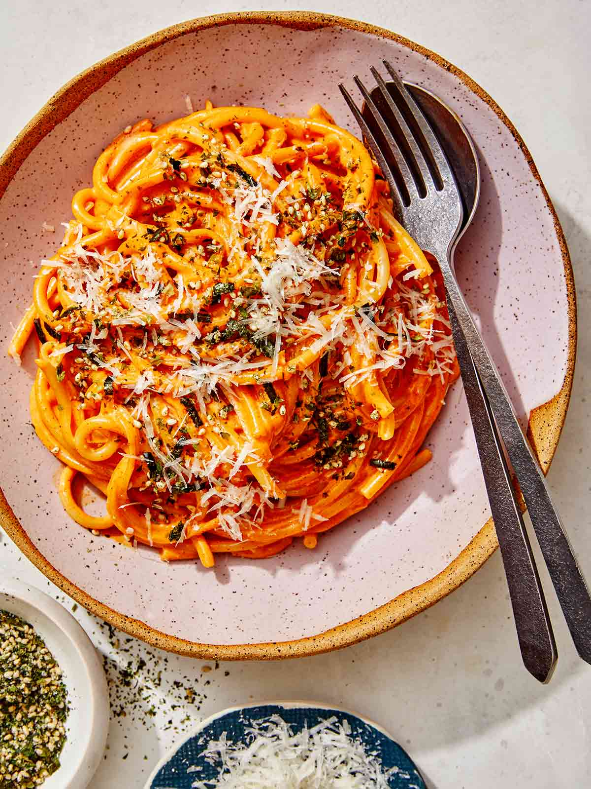

# Creamy Gochujang Pasta

## A delicious fusion between Asian and Italian cuisine what will keep you craving more. 

## Ingredients:
- Garlic
- Onions
- Protein of your choice
- Seasonings for protein (salt, pepper, oyster sauce)
- Spaghetti noodles
- Heavy cream 
- Gochujang paste
- Parmesean cheese

## Instructions:
1. Turn on the gas and wait for the pan to heat up
2. Pour in some oil, and add your garlic and onion
3. Once they turn a little brown, add in your protein
4. Season the protein to your liking, and wait for it to be cooked 
5. Add in some boiling water 
6. Meanwhile, you should be cooking your spaghetti and straining the water
6. Add a spoon of gochujang paste (or more, depends on how spicy you want the dish) + heavy cream
7. Let the liquid sauce condense
8. Add in your noodles
9. Stir the pan and you can put it out on a dish to enjoy now.